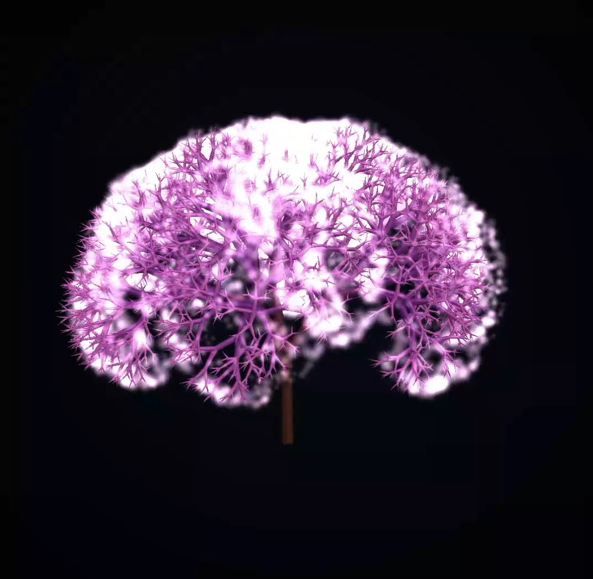

# Tree3D

A real-time 3D fractal tree demo written in C#/.NET using raw Win32, WGL, and OpenGL 3.3 core profile.

The program generates a volumetric branching tree in 3D, renders every branch segment as a tapered tube through a geometry shader, and adds glowing canopy particles at the branch tips. It is a compact low-dependency graphics demo: no game engine, no OpenGL wrapper, no NuGet packages, and no external assets.

Window creation, input handling, WGL/OpenGL context setup, OpenGL function loading, shader compilation, procedural tree generation, camera control, and rendering are implemented directly in `Program.cs`.

## Screenshot



## Features

- Procedural 3D fractal tree generation.
- Recursive branching with configurable depth, child count, length ratio, and tilt angle.
- Golden-angle style rolling of branches around the parent direction for a more organic 3D structure.
- Branches rendered as camera-facing tapered tubes using an OpenGL geometry shader.
- Radius interpolation from thick trunk to thin twigs.
- Dynamic vertex displacement that gives branches a subtle wind/sway animation.
- Glowing additive canopy sprites rendered at branch tips.
- Depth-tested rendering so near branches occlude far branches correctly.
- Background radial gradient rendered as a fullscreen quad.
- Orbit camera with mouse control, mouse-wheel zoom, and idle auto-rotation.
- Raw Win32/WGL/OpenGL implementation through P/Invoke.

## Controls

| Input | Action |
| --- | --- |
| Left mouse button + drag | Rotate/orbit the camera |
| Mouse wheel | Zoom in/out |
| Close window | Exit the program |

When the mouse is not being dragged, the camera slowly rotates automatically.

## Requirements

- Windows.
- .NET SDK.
- A GPU and driver supporting OpenGL 3.3 or newer.
- Geometry shader support.
- Visual Studio, Rider, or the `dotnet` CLI.

The project is Windows-specific because it uses direct Win32, GDI, and WGL calls through P/Invoke.

## Build and run

From the project directory:

```bash
dotnet run --project Tree3D.csproj -c Release
```

Or open the project/solution in a recent IDE that supports the project format and run the `Tree3D` project in Release mode.

## Project structure

```text
Tree3D.csproj   .NET project file
Tree3D.slnx     Solution file
Program.cs      Win32 windowing, OpenGL loading, shaders, tree generation, camera, and rendering
LICENSE         MIT license
README.md       Project description and usage notes
```

## How it works

The tree is generated recursively. Starting from a vertical trunk, each branch creates several child branches. The child directions are produced by tilting away from the parent branch and then rolling around the parent axis. A small deterministic random offset is applied to avoid a perfectly mechanical shape.

Each branch is stored as a line segment with additional per-vertex data: normalized depth and sway factor. The depth controls the visual transition from trunk to twig, while the sway factor makes thin branches move more than thick branches.

At render time, the line segments are sent to the GPU. A geometry shader expands each line into a four-vertex triangle strip, producing a camera-facing tube-like branch. The fragment shader shades the tube with a simple cylindrical lighting approximation and blends colors from brown trunk tones to brighter pink/purple twig tones.

Branch tips are rendered separately as OpenGL points. The point shader changes their size based on camera distance and time, producing a soft glowing canopy effect. Additive blending is used for these sprites while depth testing remains enabled, so the glow still respects the tree volume.

## Important parameters

The main tree parameters are defined near the top of `Program.cs`:

```csharp
const int   MaxDepth  = 8;
const int   Children  = 3;
const float Ratio     = 0.74f;
const float TiltDeg   = 36.0f;
const float TrunkR    = 0.030f;
const float TipR      = 0.0035f;
```

Useful tuning directions:

- Increase `MaxDepth` for a more complex tree. This grows the number of segments quickly.
- Increase `Children` for denser branching. This also increases geometry very quickly.
- Adjust `Ratio` to control how fast branch lengths shrink.
- Adjust `TiltDeg` to make the tree more vertical or more spread out.
- Adjust `TrunkR` and `TipR` to change branch thickness.
- Change the shader colors in `TubeFS` and `TipFS` to produce different visual styles.
- Change the sway expressions in `TubeVS` to alter wind movement.

## Implementation notes

This project deliberately avoids helper frameworks. The code manually:

- registers a Win32 window class;
- creates a native window;
- selects a pixel format;
- creates a WGL/OpenGL context;
- loads OpenGL function pointers with `wglGetProcAddress`;
- compiles GLSL vertex, geometry, and fragment shaders at runtime;
- creates VAO/VBO objects;
- processes Win32 mouse and window messages;
- implements basic matrix math for perspective and camera view transforms.

This makes the program useful as a compact reference for direct C# interop with Win32 and OpenGL without using OpenTK, Silk.NET, SDL, GLFW, or a game engine.

## Current limitations

- The program is Windows-only.
- Rendering depends on geometry shaders, which may be slower or less portable than explicit mesh generation.
- The entire project is currently contained in one source file.
- The tree is generated once at startup; it is animated only through shader-based sway.
- There is no UI for changing tree parameters at runtime.
- There are no textures, shadows, post-processing, or physically based materials.
- Error handling is intentionally minimal and demo-oriented.

## Possible improvements

- Move Win32, OpenGL, math, tree generation, and rendering code into separate files.
- Add runtime controls for tree depth, branch count, colors, wind, and camera settings.
- Generate real branch meshes on the CPU instead of relying on geometry shaders.
- Add leaf shapes or textured billboards instead of simple glowing points.
- Add shadow mapping.
- Add screenshot or video capture support.
- Add FPS/frame-time display.
- Add presets for different tree styles.
- Add export to OBJ/GLTF for the generated tree geometry.

## License

This project is licensed under the MIT License. See `LICENSE` for details.
